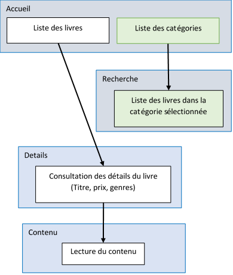

# TP .NET

# Groupe de travail:
- El Mehdi CHEIKH
- Zineb JERRARI
- Salah Eddine El Assil

# Rendu réalisé:
# Partie ASP:


On a la possibilité d'ajouter un livre tout en choisissant un ou plusieurs genres:


On visualise le livre ajouté parmi les anciens affichés :


On peut supprimer un livre :


On peut modifier un livre :


On peut ajouter un genre :


On peut visualiser le genre ajouté avec les genres déjà existants :


On peut supprimer un genre :


On peut modifier un genre :


On peut visualiser la modification apportée à ce genre :


 

# But
Construire un web service avec son client Windows pour gerer et consulter une bibliothèque de livres
# A rendre
Un web service de stockage et de gestion de livres en ligne

Un logiciel sous Windows pour consulter et lire les livres
# Contrainte
Langages autorisés : C#, HTML, Javascript

Serveur web : ASP.Net Core

Logiciel Windows : WPF
# Projet de départ
Votre solution devra être basé sur le projet Library.sln

La partie server est dans le projet ASP.Server

La partie client est dans le projet WPF.Reader
# Aide
Pour éviter les boucles infinies entre genre et livre lors de la conversion en JSON:

- Utiliser l’attribut `[JsonIgnore]` sur une des propriétés pour éviter la boucle

Pour que Entity Framework retourne les genres avec les livres : 

- Utilisez la méthode Include : `libraryDbContext.Books.Include(b => b.Genres).Where(x => x.Price > 0)`

# Fonctionnalité attendue
## Livrable
- [Une interface d'administration](#Administration)
- [Une API REST](#Api)
- [un Client lourd de lecture](#Application-Windows)

## Librairie
Stocker une bibliothèque de livres consistant en :

- Une liste de livres accessibles à la lecture
- Une liste de genres permettant de caractériser les livres

Sachant que :

- Un livre contient au minimum :
  - Un Id
  - Un titre
  - Un contenu
  - Un prix
  - Des genres
- Un livre peut avoir plusieurs genres

# Administration
Il est nécessaire pour ces fonctionnalités de mettre à disposition de l’utilisateur une interface web

Un utilisateur doit pouvoir :

- ajouter des livres dans la bibliothèque
- supprimer des livres de la bibliothèque
- Consulter la liste de tous les livres
- Consulter la liste de tous les genres

Option : 

- Faire une interface pour ajouter de nouveaux genres 
- Modifier un livre existant

Une ébauche de ce qui est attendu ce trouve dans ASP.Server/Controllers/BookController.cs et GenreController.cs


# Api
Une api REST doit être mis à disposition pour permettre à des clients externes de consulter la librairie

Une ébauche de ce qui est attendu ce trouve dans le fichier ASP.Server/Api/BookController.cs

Cette api doit permettre de :

## Récupérer un livre avec son contenu : /book/{id} 
Exemple:
```json
{
    "Id": 1, "Name": "titre", "Prix": 10.5, "Content": "contenu",
    "Genres": [{ "Id": 1, "Name": "Genre" }]
}
```
## Lister les genres disponibles: /genre
Exemple:
```json
[{
    "Id": 1, "Name": "Genre"
}, {
    "Id": 2, "Name": "Genre2"
}, { 
    …
}]
```

## Lister les livres (sans le contenu) : 
- Le résultat doit être paginé
- La recherche doit aussi pouvoir être faite en spécifiant un genre

Exemple :
- /book
```json
[{
    …
}, {
    "Id": 5, "Name": "titre", "Prix": 10.5,
    "Genres": [{ "Id": 3, "Name": "Genre" }]
}, { 
    … 
}, {
    "Id": 15, "Name": "titre2", "Prix": 12.5,
    "Genres": [{ "Id": 3, "Name": "Genre" }]
}, { 
    … 
}, {
    "Id": 20, "Name": "titre2", "Prix": 13.5,
    "Genres": [{ "Id": 3, "Name": "Genre" }]
}]
```

- /book?limit=10&offset=20
```json
[{
    "Id": 10, "Name": "titre", "Prix": 10.5, 
    "Genres": [{ "Id": 3, "Name": "Genre" }]
}, {
    "Id": 11, "Name": "titre2", "Prix": 12.5,
    "Genres": [{ "Id": 6, "Name": "Genre6" }]
}]
```

- /book?genre=3
```json
[{
    "Id": 5, "Name": "titre", "Prix": 10.5,
    "Genres": [{ "Id": 3, "Name": "Genre" }]
}, {
    "Id": 15, "Name": "titre2", "Prix": 12.5, 
    "Genres": [{ "Id": 3, "Name": "Genre" }]
}, {
    "Id": 20, "Name": "titre2", "Prix": 13.5, 
    "Genres": [{ "Id": 3, "Name": "Genre" }]
}]
```
- /book?limit=2&offset=20&genre=3 -> 
```json
[{
    "Id": 5, "Name": "titre", "Prix": 10.5,
    "Genres": [{ "Id": 3, "Name": "Genre" }]
}, {
    "Id": 15, "Name": "titre2", "Prix": 12.5,
    "Genres": [{ "Id": 3, "Name": "Genre" }]
}]
```

Il est conseiller d’utiliser :

- NSwagg (<https://docs.microsoft.com/en-us/aspnet/core/tutorials/getting-started-with-nswag?view=aspnetcore-5.0&tabs=visual-studio>)

pour générer un fichier OpenApi automatiquement, cela accélèrera grandement le développement du client. 

La solution fournie intègre NSwag par défaut


# Application Windows
## Affichage
L’application doit pouvoir permettre de :

- Lister les *N* premiers livres (vous pouvez définir la limite comme bon vous semble)
- Afficher les détails d’un livre
- Lire un livre

Options :

- Lister tous les genres
- Afficher les *N* premiers livres d’un genre (vous pouvez définir la limite comme bon vous semble)

À tout moment l’utilisateur doit pouvoir revenir à l’accueil, il n’est pas nécessaire de faire un bouton pour revenir à la page précédente

Les écrans doivent s’articuler de la façon suivante :



Les carrés bleus représentent un écran
Les carrés blancs représentent une fonctionnalité disponible sur l’écran
Les carrés verts sont optionnels

## Api
L’application doit pouvoir recevoir les livres depuis le serveur développé dans la partie précédente

Pour générer le code client vous pouvez utiliser :

- Unchased NSwag (<https://marketplace.visualstudio.com/items?itemName=Unchase.unchaseopenapiconnectedservice>) 
- NswagStudio (<https://github.com/RicoSuter/NSwag/wiki/NSwagStudio>)
- OpenApiGenerator
- ou un autre

Vous pouvez sinon faire les requêtes à la main grâce à :

- HttpClient ([System.Net.Http](https://docs.microsoft.com/en-us/dotnet/api/system.net.http?view=net-5.0))
- Restsharp (<https://www.nuget.org/packages/RestClient.Net/>)
